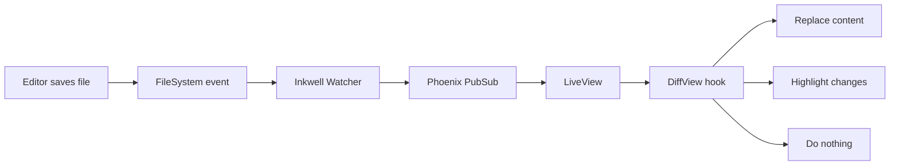

# Notes from the Field

*A sample document used to showcase Inkwell's rendering and navigation features.*

Inkwell is a live markdown preview daemon for your terminal. It watches files
for changes and pushes re-rendered HTML to the browser over a WebSocket — no
page refresh, no build step, no configuration.

This document is intentionally busy: it exercises headings, alerts, code,
tables, diagrams, task lists, and images so you can see the whole pipeline in
one place.

## Getting Started

Install the desktop app via Homebrew and open a file:

```bash
brew tap zimakki/tap
brew install --cask inkwell
inkwell README.md
```

That's it. The daemon starts on first use, binds to a random port, and opens
the preview. Save the file in your editor — the browser updates the moment
the bytes hit disk.

> [!NOTE]
> Inkwell runs **one daemon per user**, shared across every editor and
> terminal. It shuts itself down after 10 minutes of inactivity, so there's
> no lingering process to worry about.

### What makes it fast

- File watching via `FileSystem` (fsevents on macOS, inotify on Linux)
- `Phoenix.PubSub` fan-out to every live client for that file
- MDEx / comrak (Rust) for CommonMark + GFM at native speed
- Per-block diffs only re-paint what actually changed

> [!TIP]
> Open the picker from anywhere with `Ctrl+P`. It searches filenames, H1
> titles, and paths across your recent files, the current folder, and the
> whole git repository.

## Rendering Features

Inkwell supports GitHub Flavored Markdown plus a few extras that documentation
usually needs — GitHub-style alerts, Mermaid diagrams, syntax highlighting
that follows your theme, and click-to-zoom on images and diagrams.

### Syntax Highlighting

Code blocks are tokenized by [MDEx](https://github.com/leandrocp/mdex) and
coloured with a theme-aware palette that matches the rest of the document.

```elixir
defmodule Inkwell.Daemon do
  @moduledoc "Owns the daemon lifecycle and idle-shutdown state."

  use GenServer

  @idle_timeout_ms :timer.minutes(10)

  def start_link(opts), do: GenServer.start_link(__MODULE__, opts, name: __MODULE__)

  @impl true
  def init(_opts) do
    Process.flag(:trap_exit, true)
    schedule_idle_check()
    {:ok, %{clients: MapSet.new(), last_seen: now()}}
  end

  def client_connected do
    GenServer.cast(__MODULE__, {:client_connected, self()})
  end

  defp schedule_idle_check, do: Process.send_after(self(), :idle_check, @idle_timeout_ms)

  defp now, do: System.monotonic_time(:millisecond)
end
```

### Tables

Markdown tables render with aligned columns and scroll horizontally on narrow
viewports so they never overflow the page.

| Feature             | Status      | Shortcut          |
| ------------------- | ----------- | ----------------- |
| Live preview        | Stable      | —                 |
| File picker         | Stable      | `Ctrl+P`          |
| Theme toggle        | Stable      | `Ctrl+Shift+T`    |
| Diff mode           | Stable      | Mode toggle       |
| Image zoom          | Stable      | Click an image    |
| Document outline    | Stable      | Right rail        |

### Mermaid Diagrams

Fenced `mermaid` blocks render as SVG diagrams automatically.



Click any diagram or image to zoom — use the scroll wheel or pinch gesture to
pan and scale.

## Working in Diff Mode

Diff mode is the default. When a file changes, Inkwell runs a **block-level
longest-common-subsequence** diff between the previous render and the new one.
Modified blocks get a word-level diff painted over the top, and each changed
block grows a `✓` button so you can accept individual edits. `Cmd+Enter`
accepts everything visible at once — perfect for batch-reviewing a pull
request worth of prose in a single keystroke.

It works beautifully with AI assistants that rewrite parts of a document —
you see precisely what changed, paragraph by paragraph, and ratify each edit
one click at a time.

> [!WARNING]
> Diff mode keeps a DOM-level baseline of the rendered article. If you are
> editing a very large document (tens of thousands of blocks) and notice
> jank, switch to **Live** mode for full re-renders or **Static** to pause
> updates entirely.

### Task Lists

- [x] Ship block-level diffs
- [x] Per-block accept buttons
- [x] `Cmd+Enter` to accept all
- [ ] Side-by-side diff layout
- [ ] Inline comments on changed blocks

## Navigation

The right rail auto-generates a table of contents from your `h2` and `h3`
headings, and highlights the currently visible one as you scroll. Alert
blocks get their own sidebar section so you can jump straight to every note,
warning, tip, important, or caution in the document.

> [!IMPORTANT]
> Every heading gets a stable `id` derived from its text. Duplicate headings
> are disambiguated with `-2`, `-3`, etc. — so you can deep-link straight to
> a section and trust that the URL keeps working.

On mobile, the rail collapses into a floating **Map** button that opens a
bottom sheet with the same navigation.

> [!CAUTION]
> If you're serving Inkwell over a tunnel (Tailscale, ngrok, etc.) make sure
> WebSocket upgrades are allowed. Without them the preview still renders on
> first load, but live updates silently stop working.

## Wrapping Up

That's the tour. Point Inkwell at a real document, hit `Ctrl+P` to jump
between files, and let the daemon quietly watch for changes in the
background.

---

*End of demo document.*
