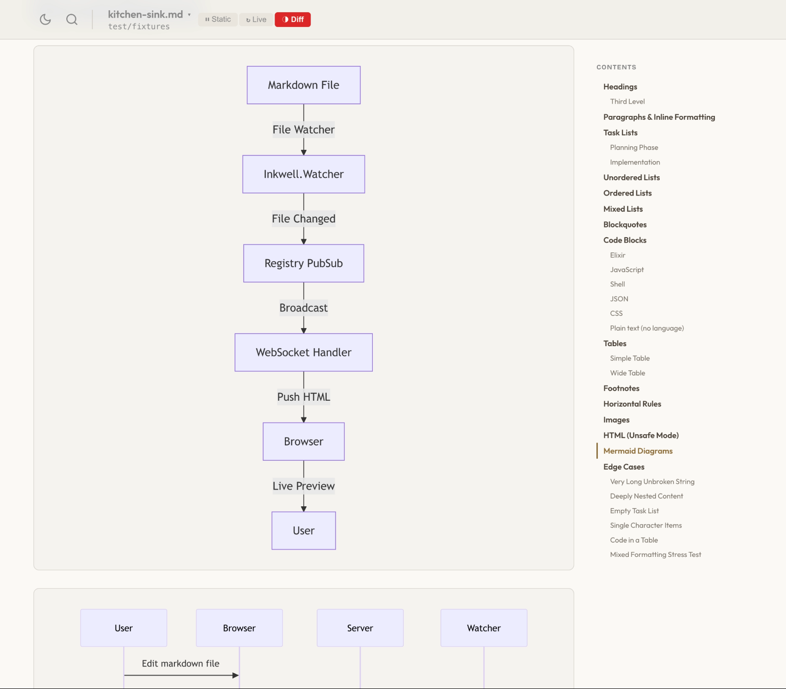
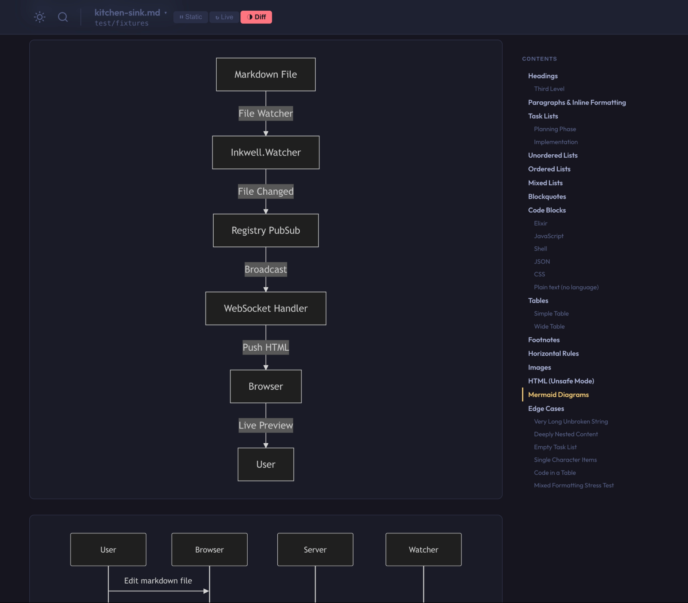
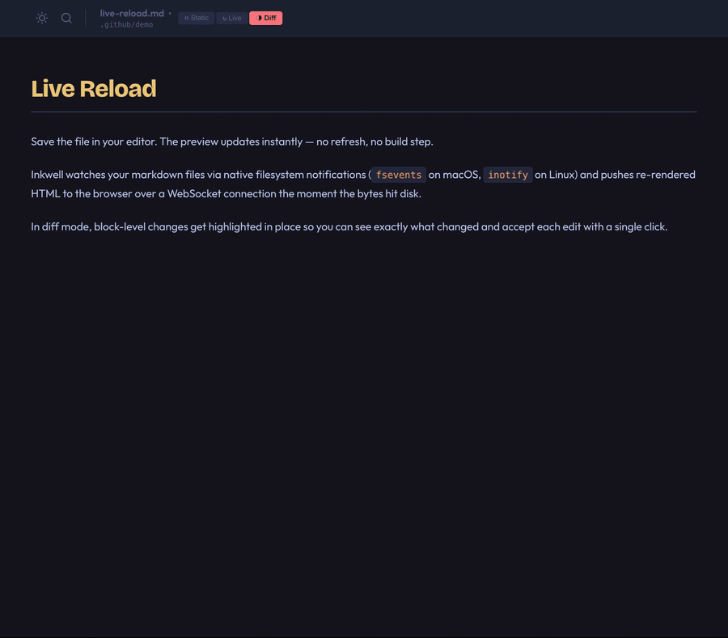
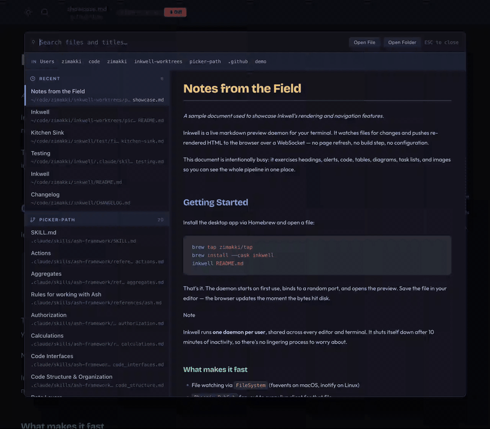
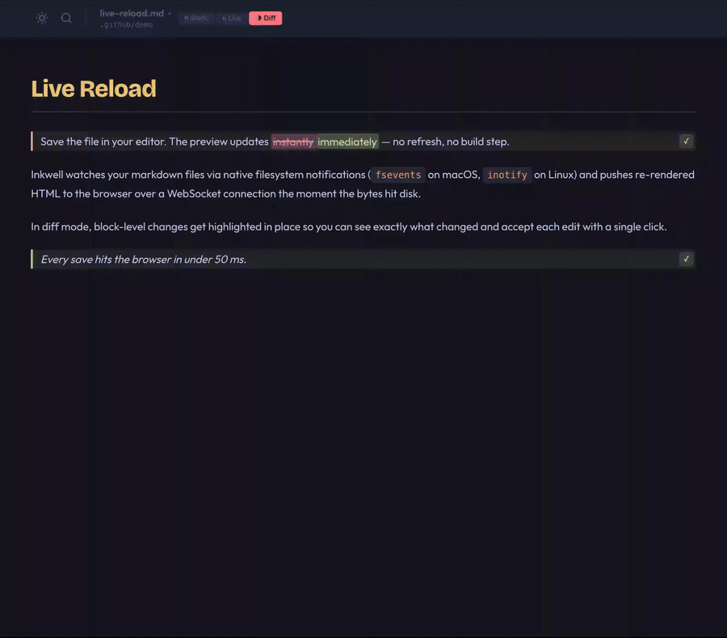
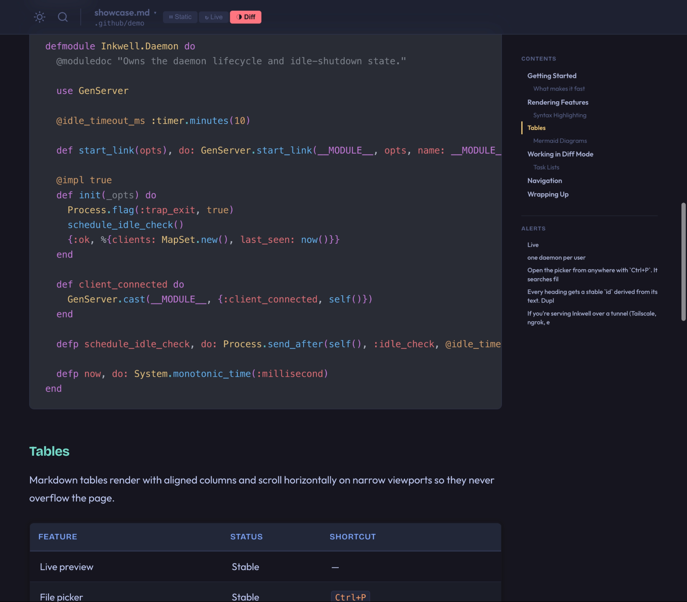
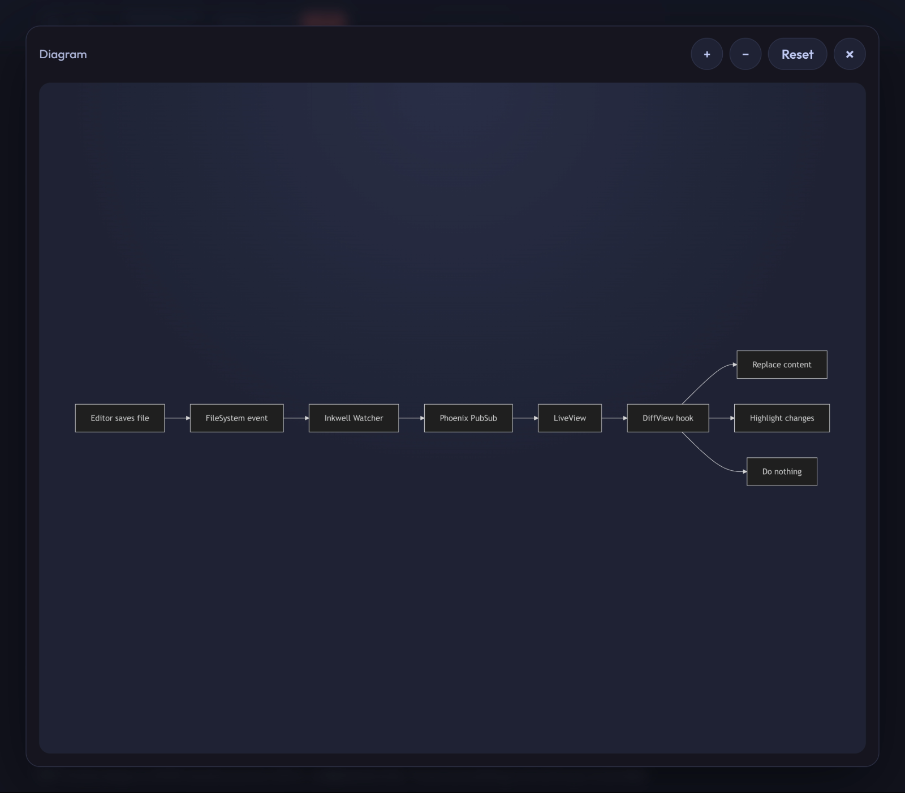
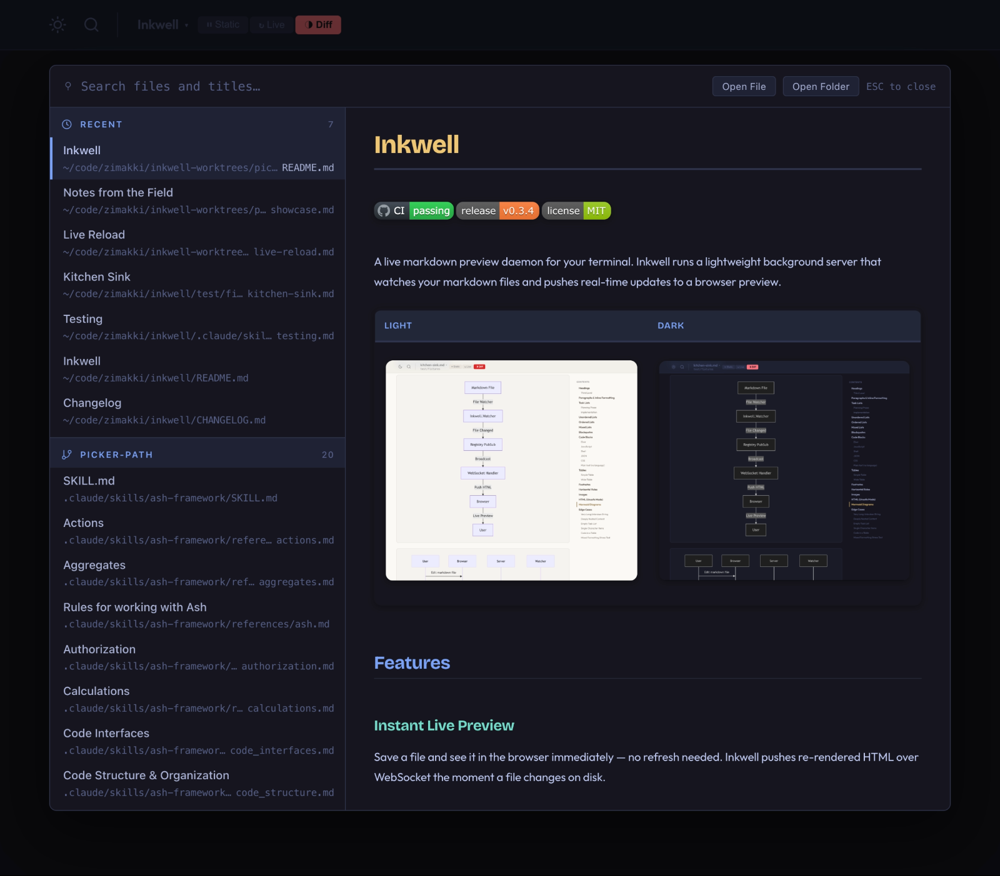

# Inkwell

[](https://github.com/zimakki/inkwell/actions/workflows/ci.yml)
[](https://github.com/zimakki/inkwell/releases)
[](LICENSE)

A live markdown preview daemon for your terminal. Inkwell runs a lightweight background server that watches your markdown files and pushes real-time updates to a browser preview.

| Light | Dark |
|-------|------|
|  |  |

## Features

### Instant Live Preview

Save a file and see it in the browser immediately — no refresh needed. Inkwell pushes re-rendered HTML over WebSocket the moment a file changes on disk.



### Smart File Navigation

Hit `Ctrl+P` anywhere to open the file picker with fuzzy search across filenames, H1 titles, and file paths. Results are grouped into sections:

- **Recent** — your most recently opened files, persisted across daemon restarts
- **In this folder** — other `.md` files alongside what you're reading
- **Repository** — every markdown file in the git repo, discovered automatically

Selecting any result previews the rendered markdown on the right before you open it. **Open File** and **Open Folder** buttons fall back to the OS-native file dialogs when you need to reach outside the current scope.



### Three Render Modes

A header toggle switches between three ways to receive live updates:

- **Static** — pause updates entirely and freeze the current preview.
- **Live** — replace the whole article on every save (classic hot reload).
- **Diff** *(default)* — run a block-level longest-common-subsequence diff against the previous render, paint modified blocks with a word-level diff, and grow a `✓` button on every changed block. `Cmd+Enter` (or `Ctrl+Enter`) accepts every visible change at once.

Diff mode is built for reviewing AI-assisted or collaborative edits — you see exactly what changed, paragraph by paragraph, and ratify each edit one click at a time.



### Rich Markdown Rendering

Full GitHub Flavored Markdown support including tables, task lists, strikethrough, autolinks, and footnotes. Plus:

- **Syntax highlighting** — theme-aware colors for code blocks (powered by [MDEx](https://github.com/leandrocp/mdex))
- **Mermaid diagrams** — fenced `mermaid` blocks render as SVG automatically
- **GitHub-style alerts** — `> [!NOTE]`, `[!TIP]`, `[!WARNING]`, `[!IMPORTANT]`, and `[!CAUTION]` blocks are parsed and auto-indexed in the sidebar
- **Dark and light themes** — toggle anytime with `Ctrl+Shift+T`, persisted across restarts



### Navigation That Keeps Up

A right-hand rail auto-generates a table of contents from your `h2` and `h3` headings and highlights the currently visible one via `IntersectionObserver`-based scrollspy. Alert blocks get their own sidebar group so you can jump straight to every note, warning, tip, important, or caution in the document.

Every heading receives a stable `id` derived from its text — duplicate slugs are disambiguated with `-2`, `-3` suffixes — so deep links and in-page anchors keep working.

On mobile, the rail collapses into a floating **Map** FAB that opens a swipeable bottom sheet with the same navigation.

### Click-to-Zoom

Click any image or Mermaid diagram to open a full-screen pan-and-zoom modal. Scroll-wheel or pinch to zoom, drag to pan, `Esc` to close.



### Open at a Folder

Point `inkwell` at a folder instead of a file and the preview boots straight into the file picker — same fuzzy search, Recent, and repository groups as `Ctrl+P`, just pre-opened so you can jump to a markdown file without opening anything first.



### Lightweight Daemon Architecture

One server per user, shared across all your editors and terminals. The daemon starts on first use, binds to a random port, and shuts itself down after 10 minutes of inactivity. No configuration needed.

### Desktop App

A native macOS app built with Tauri. When installed, Inkwell opens previews in its own window via `inkwell://` deep links instead of your browser.

### Cross-Platform

Pre-built binaries for macOS (Apple Silicon + Intel) and Linux x86_64 via [Burrito](https://github.com/burrito-elixir/burrito) self-extracting releases.

## Installation

### Homebrew Desktop App (macOS)

```bash
brew tap zimakki/tap
brew install --cask inkwell
```

### Homebrew CLI (macOS/Linux)

```bash
brew tap zimakki/tap
brew install inkwell
```

### From Source

Requires Elixir ~> 1.19.

```bash
git clone https://github.com/zimakki/inkwell.git
cd inkwell
mix deps.get
MIX_ENV=prod mix release
```

The binary will be in `burrito_out/`. Move it to somewhere on your `$PATH`:

```bash
cp burrito_out/inkwell_darwin_arm64 ~/.local/bin/inkwell
```

## Quick Start

```bash
inkwell README.md             # Preview a single file
inkwell .                     # Browse markdown files in current directory
```

This starts the daemon (if not already running), opens the preview in the desktop app when installed or your browser otherwise, and watches for changes.

## Usage

```
inkwell <path>                 Preview a markdown file or open the picker for a directory
inkwell stop                   Stop the daemon
inkwell status                 Show daemon status
```

### Options

```
--theme dark|light             Set the theme (default: dark)
--help, -h                     Show this help message
--version, -v                  Show the version
```

### Examples

```bash
inkwell .                          # Browse current directory
inkwell ~/Documents                # Browse a specific directory
inkwell README.md                  # Preview a markdown file
inkwell README.md --theme light    # Preview with light theme
```

The daemon starts automatically on first use and shuts down after 10 minutes of inactivity.

## Keyboard Shortcuts

| Shortcut | Action |
|----------|--------|
| `Ctrl+P` | Open file picker |
| `Ctrl+Shift+T` | Toggle dark/light theme |
| `Cmd+F` / `Ctrl+F` | Open find-in-document |
| `Enter` / `Shift+Enter` | Next / previous match (in find bar) |
| `Cmd+Enter` / `Ctrl+Enter` | Accept all changes (in Diff mode) |
| `Up` / `Down` | Navigate file list in picker |
| `Enter` | Open the selected file |
| `Esc` | Close file picker, find bar, or zoom modal |

## How It Works

Inkwell is a Phoenix + LiveView application running inside a self-extracting Burrito binary:

```
Inkwell.Supervisor
├── Phoenix.PubSub        — broadcasts file-change and theme events
├── Registry              — O(1) "is this directory already watched?" lookup
├── Repo                  — SQLite-backed Ash Repo (recent files, settings)
├── Daemon                — manages lifecycle, PID/port files, idle shutdown
├── WatcherSupervisor     — spawns one filesystem watcher per directory
│   └── Watcher           — monitors files, broadcasts changes
├── Telemetry
└── Endpoint (Bandit)     — HTTP + WebSocket server on a dynamic port
    ├── Router            — controllers + live_session
    └── LiveViews         — EmptyLive, BrowseLive, FileLive + PickerComponent
```

When you run `inkwell file.md`:

1. The CLI ensures the daemon is running (spawns it if needed)
2. The file is registered with the daemon via HTTP
3. A filesystem watcher starts for the file's directory
4. The browser (or desktop app via `inkwell://`) opens the preview page
5. LiveView subscribes to `"file:#{path}"` on PubSub — every save pushes fresh HTML to `article_reload` which the DiffView hook applies according to the current mode (static / live / diff)

State files live in `~/.inkwell/` (pid, port, theme, `inkwell.db`). The daemon binds to a random port to avoid conflicts.

## Development

```bash
mix deps.get                   # Install dependencies
mix test                       # Run tests (162 tests)
mix format                     # Format code
mix compile --warnings-as-errors
MIX_ENV=prod mix release       # Build standalone binary (Burrito)
```

## Contributing

1. Fork the repository
2. Create your feature branch (`git checkout -b feature/my-feature`)
3. Run tests and formatting (`mix test && mix format --check-formatted`)
4. Commit your changes
5. Open a pull request

Please ensure `mix compile --warnings-as-errors` passes before submitting.

## Bonus: Neovim Integration

Add this to your Neovim config to preview markdown files with `<leader>mp` or the `:InkwellPreview` command:

```lua
local function preview_current_markdown()
  local cmd = vim.g.inkwell_cmd or "inkwell"
  local file = vim.fn.expand "%:p"

  local job_id = vim.fn.jobstart({ cmd, file }, { detach = true })

  if job_id <= 0 then
    vim.notify("Failed to start Inkwell. Is `" .. cmd .. "` installed and on your PATH?", vim.log.levels.ERROR)
  end
end

vim.api.nvim_create_autocmd("FileType", {
  pattern = "markdown",
  callback = function(args)
    vim.api.nvim_buf_create_user_command(args.buf, "InkwellPreview", preview_current_markdown, {
      desc = "Preview the current markdown file in Inkwell",
    })

    vim.keymap.set("n", "<leader>mp", preview_current_markdown, {
      buffer = args.buf,
      desc = "Preview in Inkwell",
    })
  end,
})
```

Set `vim.g.inkwell_cmd` if your binary is installed somewhere other than `$PATH`.

## Thanks

Inkwell is built on top of some excellent open-source libraries:

- [MDEx](https://github.com/leandrocp/mdex) — fast Markdown-to-HTML with syntax highlighting, GFM, and more
- [Bandit](https://github.com/mtrudel/bandit) — pure Elixir HTTP server
- [Plug](https://github.com/elixir-plug/plug) — composable web middleware
- [WebSock](https://github.com/phoenixframework/websock) — WebSocket handling
- [FileSystem](https://github.com/falood/file_system) — cross-platform filesystem watcher
- [Burrito](https://github.com/burrito-elixir/burrito) — self-extracting binary releases for Elixir
- [Tauri](https://github.com/tauri-apps/tauri) — lightweight desktop app framework
- [Mermaid](https://github.com/mermaid-js/mermaid) — diagrams from text

## License

[MIT](LICENSE)

## Links

- [GitHub](https://github.com/zimakki/inkwell)
