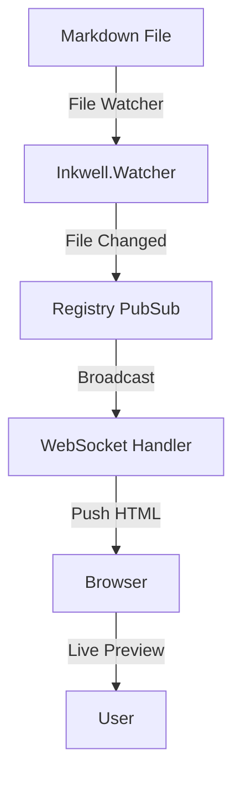
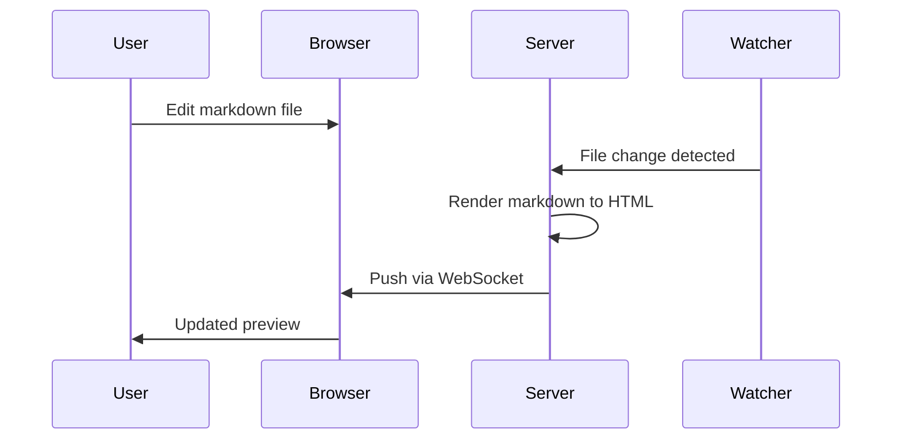

# Kitchen Sink

A comprehensive test file for every rendered element in Inkwell.

---

## Headings

### Third Level

#### Fourth Level

##### Fifth Level

###### Sixth Level

---

## Paragraphs & Inline Formatting

This is a regular paragraph with **bold text**, *italic text*, and ***bold italic*** together. You can also use ~~strikethrough~~ for deleted content.

Here's some `inline code` in a sentence, and a [hyperlink](https://example.com) plus an autolinked URL: https://example.com

This paragraph has a hard line break right here
and continues on the next line (two trailing spaces above).

---

## Task Lists

### Planning Phase

- [x] Define project scope
- [x] Write technical spec
- [x] Get stakeholder approval
- [ ] Set up development environment
- [ ] Create database migrations

### Implementation

- [ ] Build authentication system
  - [x] User registration
  - [x] Login / logout
  - [ ] Password reset flow
  - [ ] OAuth integration
- [ ] API endpoints
  - [x] GET /users
  - [ ] POST /users
  - [ ] PATCH /users/:id
- [ ] Write documentation

---

## Unordered Lists

- First item
- Second item with a longer description that might wrap to multiple lines depending on the viewport width
- Third item
  - Nested item A
  - Nested item B
    - Deeply nested
  - Nested item C
- Fourth item

## Ordered Lists

1. First step
2. Second step
3. Third step
   1. Sub-step A
   2. Sub-step B
4. Fourth step

## Mixed Lists

1. Set up the project
   - Install dependencies
   - Configure environment variables
   - Run the seed script
2. Write the feature
   - [ ] Create the module
   - [ ] Add tests
   - [x] Update changelog
3. Deploy

---

## Blockquotes

> This is a simple blockquote. It can contain **bold**, *italic*, and `code`.

> Multi-paragraph blockquote.
>
> Second paragraph with more detail. Blockquotes can be quite long and should wrap nicely across multiple lines without breaking the layout.

> Nested blockquotes:
>
> > This is a nested blockquote inside another blockquote.

---

## Code Blocks

### Elixir

```elixir
defmodule MyApp.Accounts do
  @moduledoc "Handles user account management."

  alias MyApp.Repo
  alias MyApp.Accounts.User

  def get_user!(id), do: Repo.get!(User, id)

  def create_user(attrs \\ %{}) do
    %User{}
    |> User.changeset(attrs)
    |> Repo.insert()
  end

  def list_users(opts \\ []) do
    limit = Keyword.get(opts, :limit, 20)

    User
    |> order_by(desc: :inserted_at)
    |> limit(^limit)
    |> Repo.all()
  end
end
```

### JavaScript

```javascript
async function fetchUsers(query) {
  const response = await fetch(`/api/users?q=${encodeURIComponent(query)}`);
  if (!response.ok) {
    throw new Error(`HTTP ${response.status}: ${response.statusText}`);
  }
  const { data, meta } = await response.json();
  return { users: data, total: meta.total };
}
```

### Shell

```bash
#!/bin/bash
set -euo pipefail

echo "Setting up development environment..."
mix deps.get
mix ecto.setup
mix phx.server &

echo "Server running at http://localhost:4000"
```

### JSON

```json
{
  "name": "inkwell",
  "version": "0.2.11",
  "dependencies": {
    "mdex": "~> 0.3",
    "bandit": "~> 1.0",
    "jason": "~> 1.4"
  },
  "config": {
    "theme": "dark",
    "port": null,
    "auto_open": true
  }
}
```

### CSS

```css
.container {
  display: grid;
  grid-template-columns: repeat(auto-fill, minmax(280px, 1fr));
  gap: 1.5rem;
  padding: 2rem;
}

.card {
  background: var(--bg-surface);
  border: 1px solid var(--border);
  border-radius: 12px;
  padding: 1.5rem;
  transition: transform 0.2s ease, box-shadow 0.2s ease;
}

.card:hover {
  transform: translateY(-2px);
  box-shadow: 0 8px 24px rgba(0, 0, 0, 0.12);
}
```

### Plain text (no language)

```
This is a plain code block with no syntax highlighting.
It preserves    whitespace   and
    indentation exactly as written.
```

---

## Tables

### Simple Table

| Feature       | Status    | Priority |
| ------------- | --------- | -------- |
| Live preview  | Done      | High     |
| File picker   | Done      | High     |
| Theme toggle  | Done      | Medium   |
| Git search    | In Progress | High   |
| Export PDF    | Planned   | Low      |

### Wide Table

| Module | File | Lines | Functions | Tests | Coverage | Last Modified |
| ------ | ---- | ----: | --------: | ----: | -------: | ------------- |
| Router | `lib/inkwell/router.ex` | 427 | 12 | 26 | 94% | 2025-03-14 |
| Search | `lib/inkwell/search.ex` | 298 | 18 | 15 | 87% | 2025-03-13 |
| Renderer | `lib/inkwell/renderer.ex` | 31 | 1 | 4 | 100% | 2025-03-10 |
| GitRepo | `lib/inkwell/git_repo.ex` | 145 | 8 | 12 | 91% | 2025-03-14 |

---

## Footnotes

Inkwell uses MDEx[^1] for markdown parsing, which wraps the comrak[^2] parser via Rust NIFs for excellent performance.

The rendering pipeline supports syntax highlighting through Lumis[^3], which provides Tree-sitter based tokenization.

[^1]: [MDEx](https://hex.pm/packages/mdex) — Fast and extensible Markdown for Elixir.
[^2]: [comrak](https://github.com/kivikakk/comrak) — A CommonMark + GFM compatible Markdown parser, written in Rust.
[^3]: Lumis provides over 50 themes and 200+ language grammars.

---

## Horizontal Rules

Three different syntaxes, all render the same:

---

***

___

---

## Images


---

## HTML (Unsafe Mode)

<details>
<summary>Click to expand — collapsible section</summary>

This content is hidden by default. It can contain **markdown** formatting, `code`, and other elements.

- Item one
- Item two
- Item three

</details>

<div style="padding: 1em; border-left: 3px solid var(--h2); background: var(--bg-surface); border-radius: 0 8px 8px 0; margin: 1em 0;">
  <strong>Custom callout:</strong> This is a raw HTML callout box styled with CSS variables from the theme.
</div>

---

## Mermaid Diagrams





---

## Edge Cases

### Very Long Unbroken String

`superlongfunctionnamethatdoesnotcontainanybreakpointsandmightoverflowthecontainerifnothandledproperly`

### Deeply Nested Content

> > > > > Five levels of nested blockquotes. This tests how the styling handles extreme nesting without becoming unreadable or overflowing.

### Empty Task List

- [ ]
- [x]

### Single Character Items

- a
- b
- c

### Code in a Table

| Function | Signature | Returns |
| -------- | --------- | ------- |
| `get!` | `get!(id)` | `%User{}` |
| `create` | `create(attrs)` | `{:ok, user}` or `{:error, changeset}` |
| `delete` | `delete(user)` | `{:ok, user}` |

### Mixed Formatting Stress Test

**Bold with `code` inside**, *italic with `code` inside*, ~~strikethrough with `code` inside~~, and a [link with `code`](https://example.com) for good measure.

---

*End of kitchen sink — if everything above renders cleanly, Inkwell is in good shape.*
